### 您的star是我继续前进的动力，如果喜欢pippin-liteflow-edit请右上角帮忙点个star

## 求面试，求内推，欢迎联系我 wx：kenspeckle

## 概述

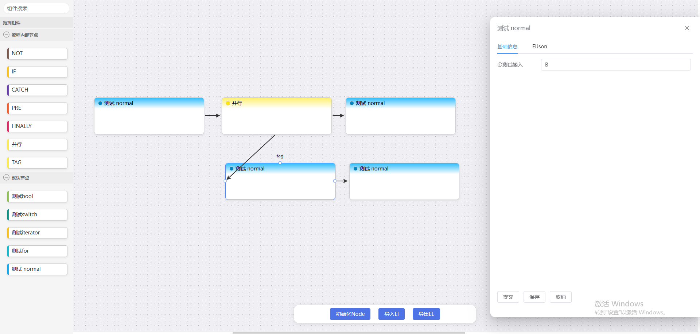

pippin-liteflow-edit 是LiteFlow 国产规则引擎框架的可视化编辑器前端项目。

采用 vue3+ts+pinia 进行项目搭建。使用 FormCreate+ElementUI+antvX6 做项目框架。

## 项目启动步骤

- 1、安装依赖： "node": ">=18.0.0"

```sh
$ npm i
```

- 2、启动服务：

```
$ npm run dev
```

## [后端代码地址](https://gitee.com/lwf_org/pippin-liteflow)

## 项目功能

### 支持项目的初始化节点

```
{
    "nodes": [
        {
            "id": "boolNode",
            "type": "boolean",
            "label": "测试bool",
            "model": "default",
            "description": "string",
            "cmpDataFormCreate": [
                {
                    "props": {},
                    "title": "测试输入",
                    "field": "field",
                    "type": "input",
                    "info": "测试输入数据"
                }
            ]
        },
        {
            "id": "switchNode",
            "type": "switch",
            "label": "测试switch",
            "model": "default",
            "description": "string"
        },
        {
            "id": "iteratorNode",
            "type": "iterator",
            "label": "测试iterator",
            "model": "default",
            "description": "string"
        },
        {
            "id": "forNode",
            "type": "for",
            "label": "测试for",
            "model": "default",
            "description": "string"
        },
        {
            "id": "normalNode",
            "type": "common",
            "label": "测试 normal",
            "model": "default",
            "description": "string",
            "cmpDataFormCreate": [
                {
                    "props": {},
                    "title": "测试输入",
                    "field": "field",
                    "type": "input",
                    "info": "测试输入数据"
                }
            ]
        }
    ],
    "models": [
        {
            "label": "默认节点",
            "model": "default",
            "description": "当未进行初始化时使用默认节点"
        }
    ]
}
```

采用json初始化节点

#### 字段描述

|字段|描述|
|--|--|
|nodes.id|自己后端定义的节点名称，进行节点的实现|
|nodes.type|节点类类型，与liteflow定义的类型做映射|
|nodes.label|ui界面上可展示的名称|
|nodes.model|ui界面上拖拽分组|
|nodes.description|节点描述（暂未使用）|
|nodes.cmpDataFormCreate|节点对应的cmpData输入表单，支持[FormCreate](https://www.form-create.com/v3/element-ui/components/input)语法 实现动态表单|
|models.label|分组名称|
|models.model|与nodes.model进行关联绑定|
|models.description|分组描述（暂未使用）|

#### 节点类型

|pippin-liteflow-edit|liteflow 实现类|
|--|--|
|boolean|NodeBooleanComponent|
|switch|NodeSwitchComponent|
|iterator|NodeIteratorComponent|
|for|NodeForComponent|
|common|NodeComponent|


### EL规则

#### 串行编排

组件相连为串行

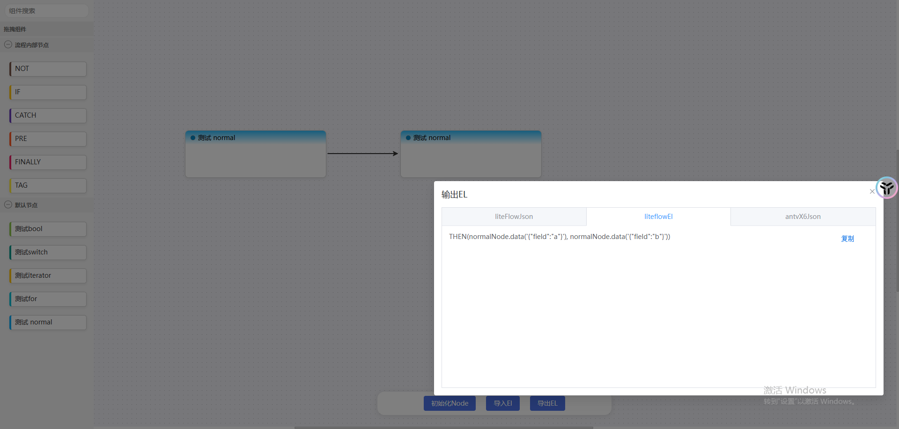

#### 并行编排

使用并行组件

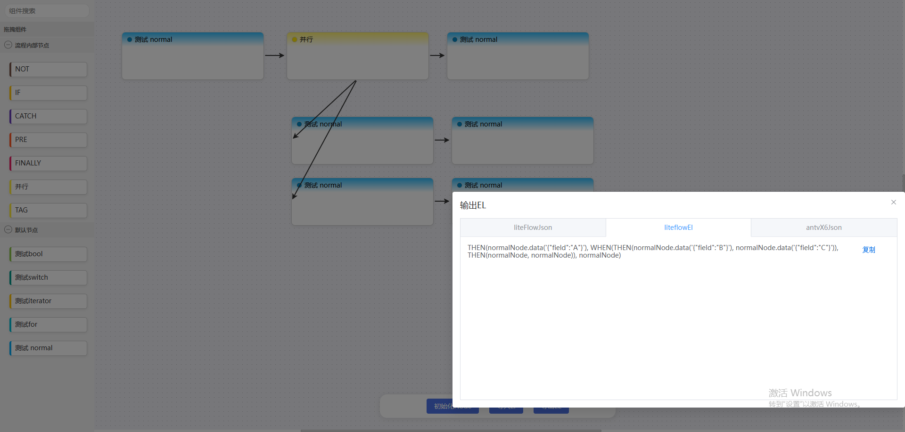

#### 选择编排

支持tag标签

1、支持节点上新增tag

2、支持编排上使用tag

3、支持default节点

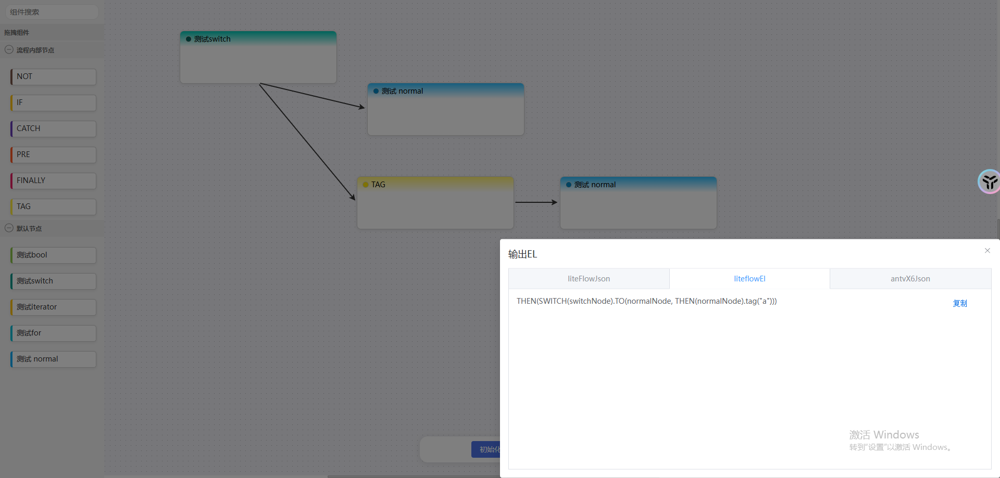

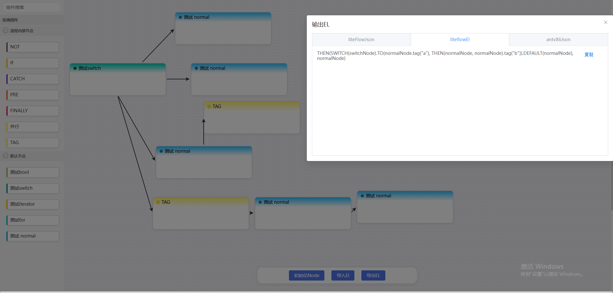

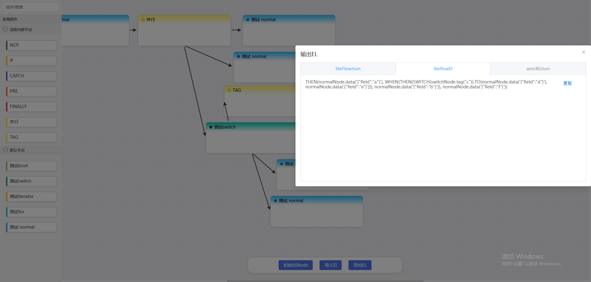

#### 条件编排

不支持ELSE表达式表达式
不支持ELSIF表达式表达式

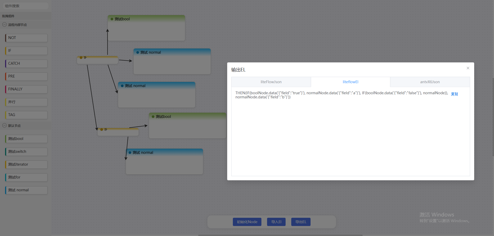

#### for循环编排

支持break

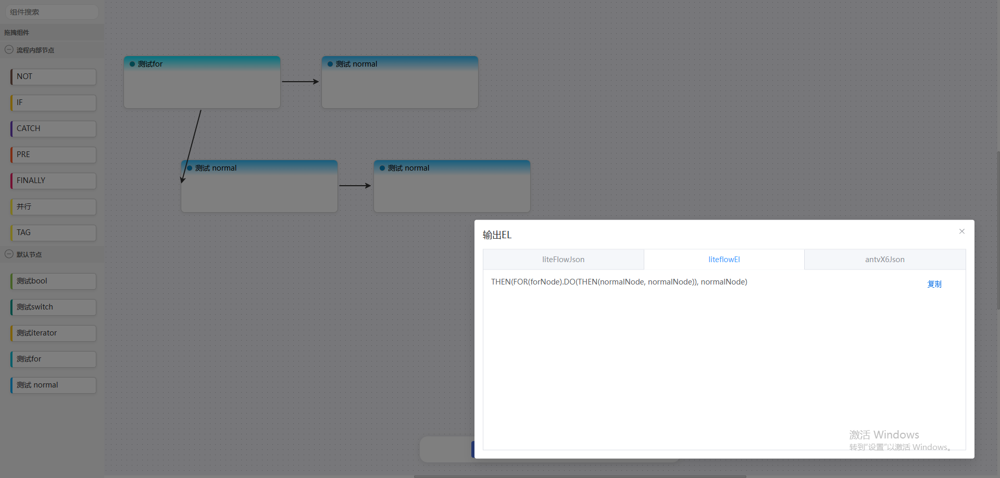

#### while循环编排

支持break


#### iterator循环编排

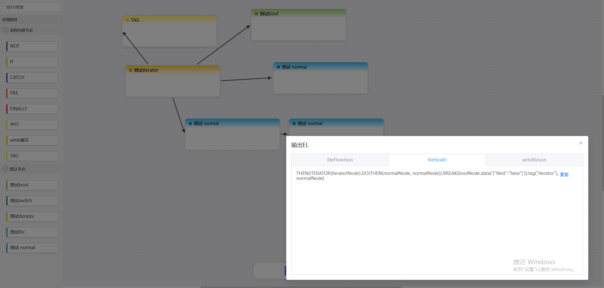

#### 异步循环模式

暂未实现

#### 捕获异常表达式

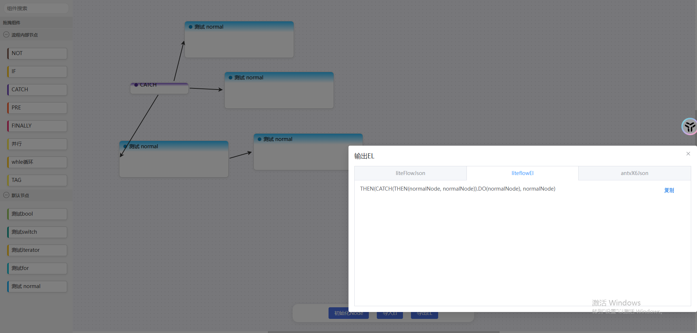

#### 与或非表达式

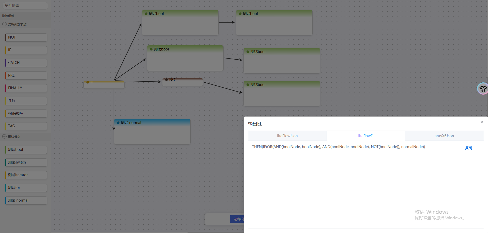

#### 使用子流程

暂未实现

#### 使用子变量

暂未实现

#### 复杂编排示例
示例

```json
THEN(
    normalNode.data('{"field":"A"}'), 
        WHEN(
            THEN(normalNode.data('{"field":"B"}'), normalNode.data('{"field":"C"}')), 
            THEN(normalNode.data('{"field":"D"}'), normalNode.data('{"field":"E"}'), normalNode.data('{"field":"F"}')),
            THEN(
                SWITCH(switchNode.tag("G")).TO(
                    THEN(normalNode.data('{"field":"H"}'), normalNode.data('{"field":"I"}'), WHEN(normalNode.data('{"field":"J"}'), normalNode.data('{"field":"K"}'))).tag("t1"), 
                    THEN(normalNode.data('{"field":"L"}'), normalNode.data('{"field":"M"}')).tag("t2")
                ),
                normalNode.data('{"field":"N"}')
            )
        ),
    normalNode.data('{"field":"Z"}')
)
```

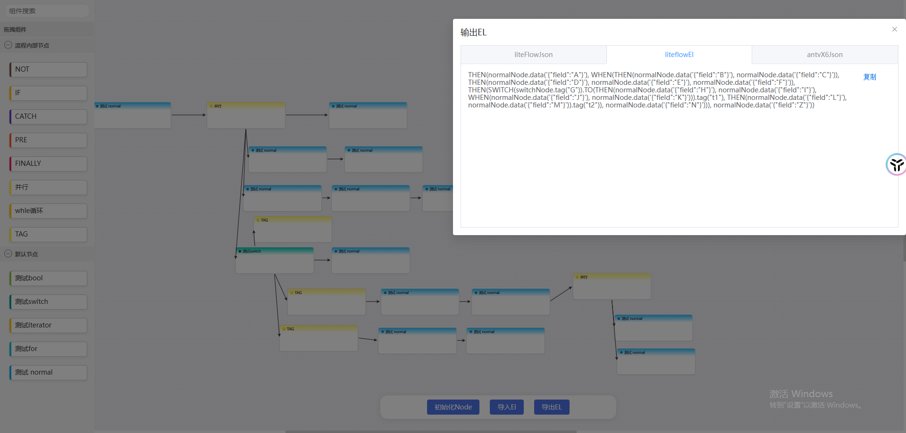

#### 前置和后置编排

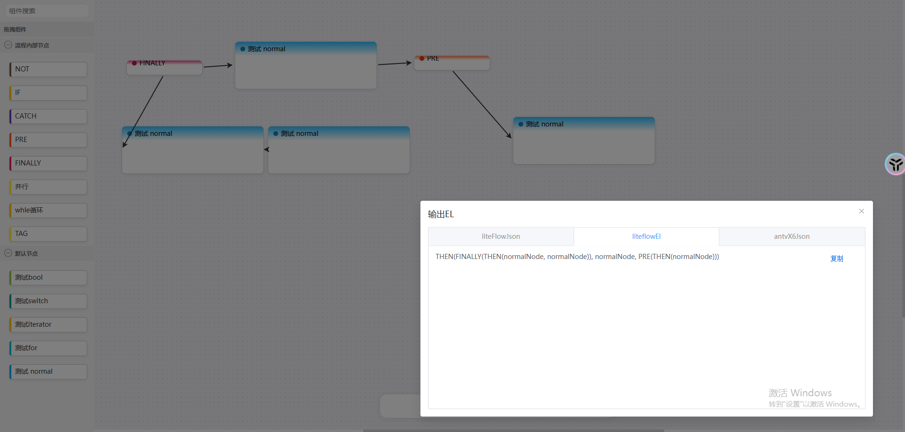

### 导出

#### 支持导出ELJson
``` json
{
  "conditionType": "then",
  "executeType": "CONDITION",
  "executableGroup": {
    "DEFAULT_KEY": [
      {
        "conditionType": "finally",
        "executeType": "CONDITION",
        "executableGroup": {
          "DEFAULT_KEY": [
            {
              "conditionType": "then",
              "executeType": "CONDITION",
              "executableGroup": {
                "DEFAULT_KEY": [
                  {
                    "id": "normalNode",
                    "type": "common",
                    "executeType": "NODE"
                  },
                  {
                    "id": "normalNode",
                    "type": "common",
                    "executeType": "NODE",
                    "cmpData": {
                      "field": "testa"
                    }
                  }
                ]
              }
            }
          ]
        }
      },
      {
        "id": "normalNode",
        "type": "common",
        "executeType": "NODE"
      },
      {
        "conditionType": "pre",
        "executeType": "CONDITION",
        "executableGroup": {
          "DEFAULT_KEY": [
            {
              "conditionType": "then",
              "executeType": "CONDITION",
              "executableGroup": {
                "DEFAULT_KEY": [
                  {
                    "id": "normalNode",
                    "type": "common",
                    "executeType": "NODE"
                  }
                ]
              }
            }
          ]
        }
      }
    ]
  }
}
```
符合liteflow思想进行组合json，支持cmpData，tag的数据绑定

#### 支持导出EL表达式

```
THEN(FINALLY(THEN(normalNode, normalNode.data('{"field":"testa"}'))), normalNode, PRE(THEN(normalNode)))
```

需要调用后端接口，进行json和EL的互转，导出可用的EL表达式，并且已经通过EL表达式的校验

#### 支持导出X6Json

```
{
  "nodes": [
    {
      "id": "23598814-8a68-439f-9a2f-60b3bfe840f4",
      "shape": "pippin-finally"
    },
    {
      "id": "50b19200-179d-4141-94f6-11fe7e38e058",
      "shape": "normalNode"
    },
    {
      "id": "4aef727b-722e-4985-bd09-720448cd8761",
      "shape": "normalNode"
    },
    {
      "id": "a2f1c512-92b6-45e3-8f2c-6bd2eb2f70a8",
      "shape": "normalNode"
    },
    {
      "id": "fe69f7ae-1eb1-4702-9b30-3d20b0d56d8f",
      "shape": "pippin-finally"
    },
    {
      "id": "bd38276d-5928-427f-9a6e-fac23f52d608",
      "shape": "normalNode"
    }
  ],
  "edges": [
    {
      "id": "f753bf90-f1c8-4b7c-af05-0f4c13aad9e9",
      "shape": "edge",
      "source": {
        "cell": "23598814-8a68-439f-9a2f-60b3bfe840f4",
        "port": "defaultPort"
      },
      "target": {
        "cell": "50b19200-179d-4141-94f6-11fe7e38e058",
        "port": "beforePort"
      }
    },
    {
      "id": "0fcf1910-3db1-4a95-a394-32e5c0a14efb",
      "shape": "edge",
      "source": {
        "cell": "50b19200-179d-4141-94f6-11fe7e38e058",
        "port": "nextPort"
      },
      "target": {
        "cell": "4aef727b-722e-4985-bd09-720448cd8761",
        "port": "beforePort"
      }
    },
    {
      "id": "eda53309-31ae-4d76-876b-d39adbd851eb",
      "shape": "edge",
      "source": {
        "cell": "23598814-8a68-439f-9a2f-60b3bfe840f4",
        "port": "nextPort"
      },
      "target": {
        "cell": "a2f1c512-92b6-45e3-8f2c-6bd2eb2f70a8",
        "port": "beforePort"
      }
    },
    {
      "id": "fcf238b3-0a99-4462-a120-d47f19659933",
      "shape": "edge",
      "source": {
        "cell": "a2f1c512-92b6-45e3-8f2c-6bd2eb2f70a8",
        "port": "nextPort"
      },
      "target": {
        "cell": "fe69f7ae-1eb1-4702-9b30-3d20b0d56d8f",
        "port": "beforePort"
      }
    },
    {
      "id": "04d5d607-9fb3-40dc-91ce-c13b07edca19",
      "shape": "edge",
      "source": {
        "cell": "fe69f7ae-1eb1-4702-9b30-3d20b0d56d8f",
        "port": "defaultPort"
      },
      "target": {
        "cell": "bd38276d-5928-427f-9a6e-fac23f52d608",
        "port": "beforePort"
      }
    }
  ]
}
```
可展示节点和边的关系，可用于导入数据进行回显节点连接

### 导入

目前导入的节点编排关系是没问题的，但是存在节点位置不好看的问题，后面进行处理

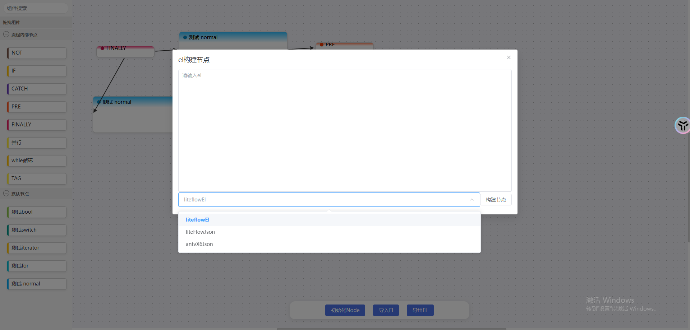

#### 支持导入EL表达式

会需要连接后端接口，转成json数据后再处理成x6Json数据进行节点的回显

#### 支持导入ELJson

json数据后会处理成x6Json数据进行节点的回显

#### 支持导入x6Json

直接回显节点和边的关系